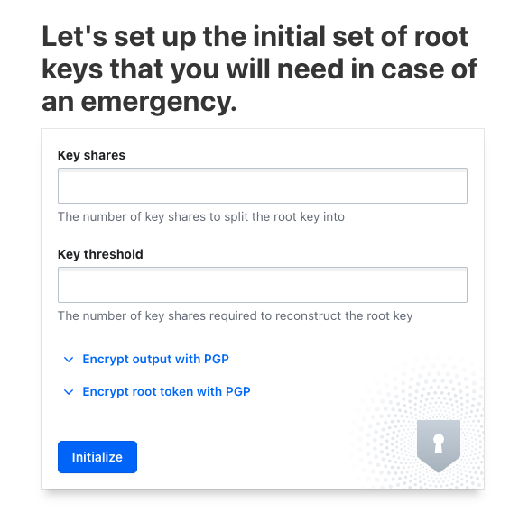
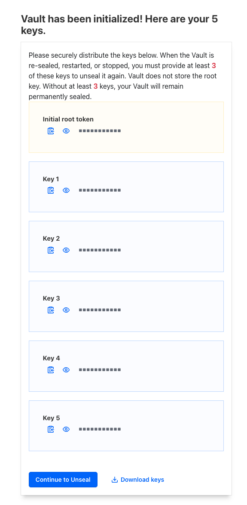
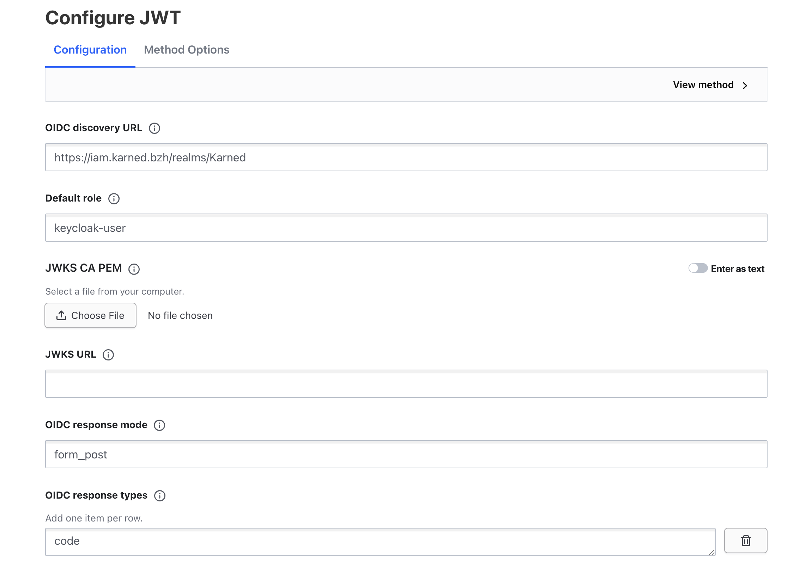

# hashicorp-vault

installer le vault

## initialisation

se rendre sur l'UI 



répondre 5 et 3
Vous aurez 5 clés et 3 seront nécessaires pour déverouiller le vault



Voici les clés qui ne seront affichées qu'une seule fois !!!

Si vous perdez trop de clés... vous perdez l'accès au vault

## Unseal
se rendre sur l'UI

rentrer 3 clés sur les 5

## Format de stockjage
secret/data/entities/<entity_uuid>/licenses/<license_uuid>/<service>

## mise en place

il faut installer vault en local pour pouvoir tester

```bash
brew tap hashicorp/tap
brew install hashicorp/tap/vault
```

### JWT token

il est possible de s'authentifier avec un token JWT issu de Keycloak
Pour cela, il faut configurer le vault pour qu'il puisse valider les tokens JWT émis par Keycloak.



la même chose peut être faite avec la CLI

```sh
vault write auth/jwt/config \
  oidc_discovery_url="https://keycloak.tld/realms/myRealm" \
  bound_issuer="https://keycloak.tld/realms/myRealm" \
  default_role="keycloak-user"
```

L'API credential n'utilisera pas cette option de connexion. Elle n'est pas assez sécurisée dans ce cas de figure.

### Role


```sh
vault write auth/jwt/role/keycloak-user \
  role_type="jwt" \
  user_claim="email" \
  bound_audiences="karned" \
  policies="default" \
  ttl="1h"
```

### Authentification

api-access-policy.hcl
```txt
path "secret/data/*" {
  capabilities = ["read", "list"]
}

path "secret/metadata/*" {
  capabilities = ["read", "list"]
}

```

application de la policy
```sh
vault policy write api-access-policy ./api-access-policy.hcl
```

Génération du token JWT
```sh
vault token create -policy="api-access-policy" -period=24h -orphan
```

## Renew Vault Token
Le Vault token a une durée de vie limitée. 
Il faut le renouveler régulièrement pour éviter qu'il n'expire.

Le renouvellement est effectué en Cronjob.

La source est dans le dossier crontask/renew

Le renouvellement est effectué toutes les 24 heures par prolongation du TTL.

Pour changer le token, il faut en créer un nouveau et mettre à jour le secret correspondant.
Une fois le secret mis à jour, il faut supprimer le cache ou attendre le renouvellement.